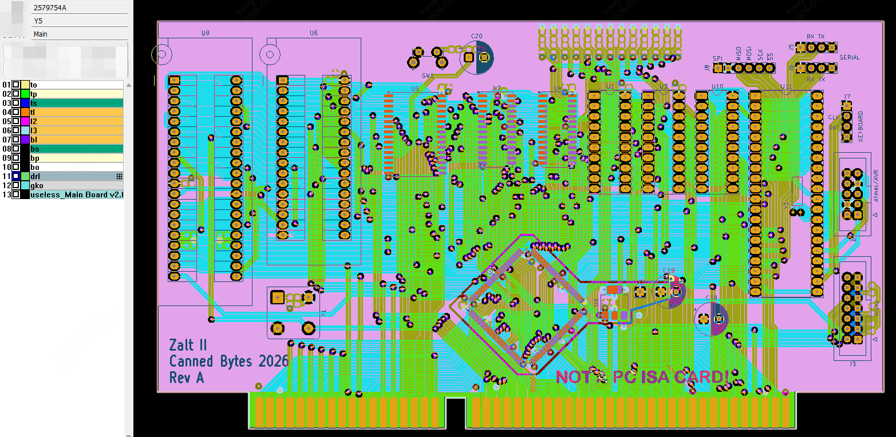
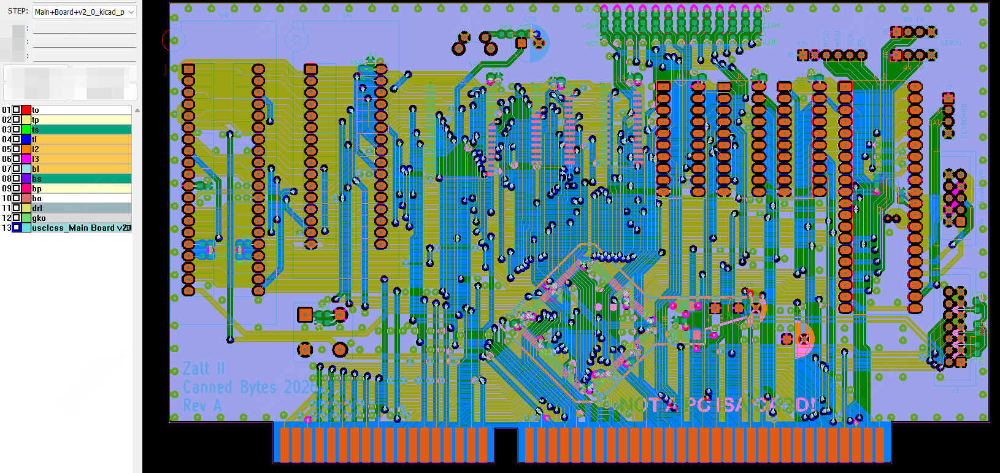

# JLCPCB Production Issues

To the best of my knowledge I uploaded the [13-05 gerbers](./Kicad/_production/2026-05-13-16-06-13/Main%20Board%20v2.0.kicad_pcb_gerber.zip) to place the order with JLCPCB (W2026051322175247) at 13-05-2026.

Upon receiving the PCBs (which was pretty quick) I noticed that all my ground vias were not present on the PCB manufactured by JLCPCB.

I contacted them and they (after sales) were pretty adament that my original gerbers did not include any ground vias.

JLCPCB
```
Dear Customer,
Thank you for contacting JLCPCB regarding your order.
From our live chat conversation, you indicated that all of the ground vias in your PCBs were removed. Before we can investigate further, could you kindly provide a picture clearly indicating where the ground vias were removed?
Once we receive the image, we will proceed with checking the issue.
Thank you for your cooperation.
Best regards,
Nick
```

Me
```
Hi Nick,
I have attached a photo of the right-bottom corner where I had placed some via's around the edge. Clearly they are not there. Also attached is the zip file I uploaded for this order.
Looking forward to your reply.
Marc Jacobi
```

JLCPCB
```
Dear Marc,
Thank you for your message and for providing the photo and the ZIP file.
Upon comparing the Gerber file you provided via email with the Gerber file you originally uploaded for your order, we found that they are different. The file you uploaded for production does not contain the vias you indicated, as shown in the images below:
Gerber file uploaded for production:
```

```
Gerber file you provided via email:
```

```
Your PCBs were manufactured exactly according to the Gerber file you uploaded at the time of order placement.
```

My reply:
```
Hi Nick,
Clearly the production file I can download from the order page, is NOT my original file.
This is not a satisfactory conclusion.
Marc
```

JLCPCB:
```
Dear Marc,
Thank you for your message, and we sincerely apologize for the inconvenience caused.
We have noted your concern. We will request our after‑sales team to review your order issue again. Once we have determined the cause, we will get back to you.
Thank you for your patience.
Best regards,
Nick
```

There followed some more emails offering me a $3 coupon!
I just left it at that.

## 3V3 inner layer plane.

> Later I noticed that the 3V3 plane was not entirely connected, too. There are no errors in Kicad that indicate that they were not connected so is this another production issue?

It turns out that in my design I had two separate fills touching in Kicad.
In their gerbers these do not touch anymore and cause the 3V3 plane to be interrupted.

So if you're using separate fills for the same net, overlap them generously.

Another part that was also a separate fill overlapped, and did connect ok on the production gerbers.
